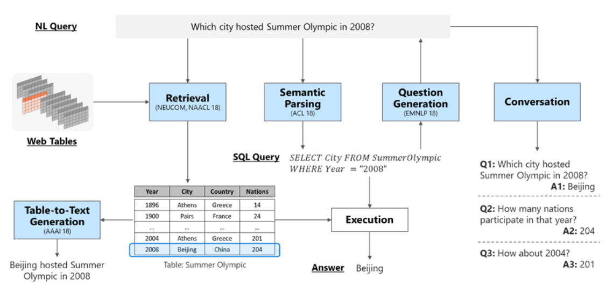
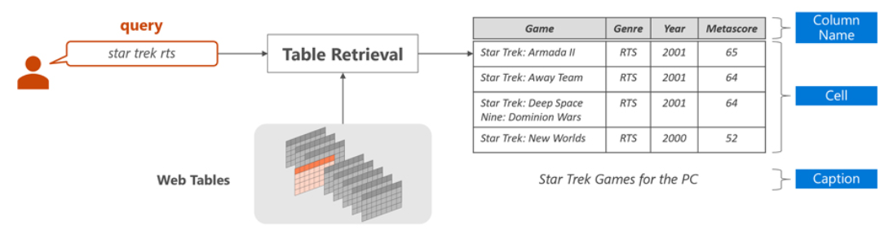
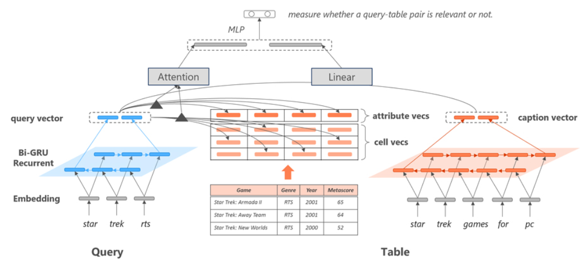

# TQA调研——学术界

## 目录

## 1. 任务

### 1.1 概述

#### 1.1.1 背景

世界上许多信息都是以表格形式存储的，这些表格见诸于网络、数据库或文件中。它们包括消费产品的技术规格、金融和国家发展统计数据、体育赛事结果等等。目前，要想找到问题的答案，人们仍需以人工方式查找这些表格，或使用能提供特定问题（比如关于体育赛事结果的问题）的答案的服务。如果可通过自然语言来查询这些信息，那么取用这些信息会容易很多。 

#### 1.1.2 表格问答定义

**表格问答**就是针对一个**自然语言问题**，基于表格内容给出答案。 问题的答案既可以是表格中包含的一个或多个表格单元，也可以是表格中推理出来的、并未出现的值。

狭义上的表格问答是**仅针对表格**的问答，但随着相关研究的进行，出现了许多**表格+文本**的、类似文档形式的混合数据集。这些数据集依赖对表格的理解，也因此，广义上的表格问答可看做是**包含表格数据**的问答。

#### 1.1.3 表格分类

表格可分为**结构化表格**和**半结构化表格**。

#### 结构化表格（Well-structured Table）

结构化表格以数据库形式的表格为主。这类表格由M行N列数据组成。每一行由N个表格单元构成，表示一条信息记录；每一列由M个表格单元构成，同一列中的所有表格单元具有相同的类型。这类表格具有规范化的格式，在表格研究中较为简单。

#### 半结构化表格（Semi-structured Table）

半结构化的表格不如结构化表格规范，其往往包含了单元格合并、层次化表头等复杂结构形式，在代码层面也有特定的书写格式。常见的半结构化表格来源有：HTML、Latex、Excel、Word。

#### 1.1.4 任务细分

对于表格问答，参考相关研究和<a href='#zs'>综述</a>，我们可以将任务按以下角度进行细分。

<table>
    <tr>
        <td>角度</td><td>分类</td><td>解释</td>
    </tr>
    <tr>
        <td rowspan="3">问题类别</td><td>事实(Factoid)</td><td>询问一个特定的事实，答案来自于表格中的一个片段或由聚合操作得到的值</td>
    </tr>
    <tr>
        <td>自由形式(Free Form)</td><td>回答无固定格式，通常较长，类似于对话，如ChatGPT一样</td>
    </tr>
    <tr>
        <td>多项选择(Multiple Choice)</td><td>问题要求从多个选项中选择一个作为答案</td>
    </tr>
    <tr>
        <td rowspan="2">数据类别</td><td>仅包含表格(Table Only)</td><td>数据集里仅包含表格这一种数据形式</td>
    </tr>
    <tr>
        <td>表格+其他数据形式(Non Table Only)</td><td>除了表格本体，还包含表格附近的文本或其他文本信息，甚至是其他数据模态</td>
    </tr>
    <tr>
        <td rowspan="2">表格类别</td><td>普通表格(Flat)</td><td>表格较为规整，一般只有一级的列表头</td>
    </tr>
    <tr>
        <td>层次化表格(Hierarchical)</td><td>表格可能包含行表头和列表头，同时表格不止一级，具有层次化的结构</td>
    </tr>
    <tr>
        <td rowspan="2">Domain Type</td><td>开放域(Open Domain)</td><td>面向真实场景，需要先从大量数据中检索得到候选表格及其他文本，再从中推理出答案</td>
    </tr>
    <tr>
        <td>封闭域(Close Domain)</td><td>面向有限数量的表格或文本，一般仅包含一个表格或少量的文本片段，从中推理得到答案</td>
    </tr>
</table>

#### 1.1.5 发展趋势

表格问答的发展趋势是真实化，其逐步向真实的场景靠拢。近两年的研究不止局限于单纯的表格，还有许多复杂表格、表格文本混合数据、专有领域等方面的研究。在方法层面，基于语义解析的方法逐渐减少，取而代之的是基于transformer、预训练等的模型方法。

### 1.2. 相关任务

#### 1.2.1 表格问答相关任务

 目前，与表格相关的自然语言处理研究发展迅速，数据集大幅增加，学术界已有许多成熟的方法。此处我们按照MSRA的相关工作，将与表格问答相关的任务定义为以下五类（未包含大部分的表格任务）。

- 表格检索：从表格集合中找到与输入问题最相关的表格
- 语义解析：将自然语言问题转换成可被机器理解的语义表示（meaning representation，一般指SQL语句），在表格中执行该表示即可获得答案
- 问题生成：可看作语义解析的逆过程，能减轻语义解析器对大量标注训练数据的依赖
- 对话：主要用于多轮对话场景的语义解析任务，需有效解决上下文中的省略和指代现象
- 文本生成：使用自然语言描述表格中（如给定的一行）的内容

#### 1.2.2 表格检索 (Table Retrieval)

对于给定的自然语言q和给定的表格全集T={T1, T2, .., Tn}，表格检索任务的目的是从T中找到与q内容最相关的表格，如下图所示。每个表格通常由三部分构成：表头/列名（table header）、表格单元（table cell）和表格标题（table caption）。广义上的表格问答有时也会面对包含表格一个或多个文档，在面向开放域或混合数据问答时，需要依赖表格检索模块得到候选的表格或其他文本。

在方法实现上，表格检索往往会经历表格候选检索和表格候选打分两个步骤。

#### 表格候选检索

从表格全集中快速筛选得到一个表格子集T={T1, T2, .., Tn}，并尽量保证与Q最相关的表格包含在T之中。

- **表格全集相对有限**：可以将每个表格的结构打散并将内容顺序连接构成一个“文档”，然后基于现有文本检索技术找到与输入问题Q最相关的表格子集T
- **表格全集为互联网所有表格**：需要先基于搜索引擎找到与问题最相关的结果页面集合。然后抽取该结果网页集合中包含的全部表格作为表格子集T。这一过程无法保证排名靠前网页中包含的表格和输入问题之间也存在较高的相关性，这也就引入了下一个任务。

#### 表格候选打分

表格候选打分负责计算表格子集T中每个表格和问题Q的相关度，并选择与Q相关度最高的表格作为表格检索的结果：

})

其中\}_{i=1}^{N})表示N个特征函数，每个特征函数用来衡量Q和的某种相关性。是特征函数集合对应的特征权重集合，它通过在标注数据上使用机器学习算法训练得到。

- 如果将表格看作文档，可以采用文本检索中最常见的BM25作为一个表格候选打分特征。

- 如果将表格看作字符串，忽略表格结构，最长公共子串、编辑距离在内的多种字符串匹配方法都可以用来设计匹配特征。
- [Cafarella等人](https://sirrice.github.io/files/papers/webtables-vldb08.pdf)介绍Google搜索引擎中表格检索模块所使用的部分特征，包括表格的行数，列数，内容为空的表格单元数，表格所在网页在网页搜索结果中的排序，问题和表头的匹配度、问题和表格标题的匹配度、问题和表格单元集合的匹配度、问题和最左边第一列表格单元集合的匹配度等。
- [Balakrishnan等人](https://storage.googleapis.com/pub-tools-public-publication-data/pdf/43806.pdf)基于知识图谱对表格单元进行实体匹配，根据表格单元匹配实体的类型标记表格单元和对应表头，并使用该信息设计问题和表格之间的相关度特征。
- [Yan等人](https://arxiv.org/pdf/1706.02427.pdf)提出基于神经网络的表格检索模型，通过将输入问题和表格转化为向量表示，计算二者之间的相似度。

### 1.3. 评测标准

- （主要用于评估查询语句执行后答案的质量）
-    (测量与正确SQL查询具有完全匹配的字符串的生成SQL查询的百分比)
- （主要用于评估SQL关键词匹配的效果）
- （主要用于多答案问题的答案查询效果）

### 1.4. 数据集

#### 1.4.1 数据集总览

最初的数据集通常只包含表格，但随着相关研究发展，出现了许多包含的表格+文本的数据。依据上述<a href='#task_classify'>任务细分</a>，我们将表格问答相关数据集进行分类汇总，如下表所示：

<table>
    <tr>
        <td>数据类型</td><td>数据集(下载链接)</td><td>年份</td><td>问题类型</td><td>开放域</td><td>表格 结构</td><td>数据集论文</td>
    </tr>
    <tr>
        <td rowspan="6">只有表格</td>
        <td><a href='https://ppasupat.github.io/WikiTableQuestions/'>WikiTableQuestion</a></td>
        <td>2015</td>
        <td>事实</td>
        <td></td>
        <td></td>
        <td><a href='https://aclanthology.org/P15-1142.pdf'>Compositional semantic parsing on semi-structured tables</a></td>
    </tr>
    <tr>
        <td><a href='http://aka.ms/sqa'>Sequential QA</a></td>
        <td>2017</td>
        <td>事实</td>
        <td></td>
        <td></td>
        <td><a href='https://aclanthology.org/P17-1167.pdf'>Search-based neural structured learning for sequential question answering</a></td>
    </tr>
    <tr>
        <td><a href='https://github.com/salesforce/WikiSQL'>WikiSQL</a></td>
        <td>2017</td><td>事实</td>
        <td></td>
        <td></td>
        <td><a href='https://arxiv.org/pdf/1709.00103'>Seq2sql: Generating structured queries from natural language using reinforcement learning</a></td>
    </tr>
    <tr>
        <td><a href='https://yale-lily.github.io//spider'>Spider</a></td>
        <td>2018</td>
        <td>事实</td>
        <td></td>
        <td></td>
        <td><a href='https://aclanthology.org/D18-1425.pdf'>Spider: A large-scale human-labeled dataset for complex and cross-domain semantic parsing and text-to-sql task</a></td>
    </tr>
    <tr>
        <td><a href='https://github.com/IBM/AITQA'>AIT-QA</a></td>
        <td>2021</td>
        <td>事实</td>
        <td></td>
        <td>层次化</td>
        <td><a href='https://aclanthology.org/2022.naacl-industry.34.pdf'>AIT-QA: Question Answering Dataset over Complex Tables in the Airline Industry</a></td>
    </tr>
    <tr>
        <td><a href='https://github.com/microsoft/HiTab'>HiTab</a></td>
        <td>2022</td>
        <td>事实</td>
        <td></td>
        <td>层次化</td>
        <td><a href='https://aclanthology.org/2022.acl-long.78.pdf'>HiTab: Hierarchical Table Dataset for Question Answering and Natural Language Generation</a></td>
    </tr>
    <tr>
        <td rowspan="9">表格+ 文本</td>
        <td><a href='https://github.com/wenhuchen/Table-Fact-Checking'>TabMCQ</a></td>
        <td>2016</td>
        <td>多项选择</td>
        <td></td>
        <td></td>
        <td><a href='https://arxiv.org/pdf/1602.03960'>Tabmcq: A dataset of general knowledge tables and multiple-choice questions</a></td>
    </tr>
    <tr>
        <td><a href='https://github.com/wenhuchen/OTT-QA'>OTTQA</a></td>
        <td>2020</td>
        <td>事实</td>
        <td>是</td>
        <td></td>
        <td><a href='https://openreview.net/pdf?id=MmCRswl1UYl'>Open question answering over tables and text</a></td>
    </tr>
    <tr>
        <td><a href='https://github.com/wenhuchen/HybridQA'>HybirdQA</a></td>
        <td>2020</td>
        <td>事实</td>
        <td></td>
        <td></td>
        <td><a href='https://aclanthology.org/2020.findings-emnlp.91.pdf'>HybridQA: Dataset of Multi-Hop Question Answering over Tabular and Textual Data</a></td>
    </tr>
    <tr>
        <td><a href='https://github.com/nju-websoft/TSQA'>GeoTSQA</a></td>
        <td>2021</td>
        <td>多项选择</td>
        <td></td>
        <td></td>
        <td><a href='https://ojs.aaai.org/index.php/AAAI/article/view/17570/17377'>TSQA: Tabular Scenario Based Question Answering</a></td>
    </tr>
    <tr>
        <td>NQ-tables</td>
        <td>2021</td>
        <td>事实</td>
        <td>是</td>
        <td></td>
        <td><a href='https://aclanthology.org/2021.naacl-main.43.pdf'>Open domain question answering over tables via dense retrieval</a></td>
    </tr>
    <tr>
        <td><a href='https://github.com/czyssrs/FinQA'>FinQA</a></td>
        <td>2021</td>
        <td>事实</td>
        <td></td>
        <td></td>
        <td><a href='https://aclanthology.org/2021.emnlp-main.300.pdf'>Finqa: A dataset of numerical reasoning over financial data</a></td>
    </tr>
    <tr>
        <td><a href='https://nextplusplus.github.io/TAT-QA/'>TAT-QA</a></td>
        <td>2021</td>
        <td>事实</td>
        <td></td>
        <td>少量层次化</td>
        <td><a href='https://aclanthology.org/2021.acl-long.254.pdf'>TAT-QA: A question answering benchmark on a hybrid of tabular and textual content in finance</a></td>
    </tr>
    <tr>
        <td><a href='https://github.com/Yale-LILY/FeTaQA'>FeTaQA</a></td>
        <td>2022</td>
        <td>自由形式</td>
        <td></td>
        <td></td>
        <td><a href='https://direct.mit.edu/tacl/article-pdf/doi/10.1162/tacl_a_00446/2012156/tacl_a_00446.pdf'>FeTaQA: Free-form Table Question Answering</a></td>
    </tr>
    <tr>
        <td><a href='https://github.com/psunlpgroup/MultiHiertt'>MultiHiertt</a></td>
        <td>2022</td>
        <td>事实</td>
        <td></td>
        <td>层次化</td>
        <td><a href='https://aclanthology.org/2022.acl-long.454.pdf'>MultiHiertt: Numerical Reasoning over Multi Hierarchical Tabular and Textual Data</a></td>
    </tr>
</table>

#### 1.4.2 部分数据集介绍

####  WikiTableQuestions

- **相关论文**：Compositional semantic parsing on semi-structured tables
- **下载链接**：[链接](https://ppasupat.github.io/WikiTableQuestions/)
- **说明**：该数据集由斯坦福在2015年发布,主要针对表格问答任务。该数据集总共包含22033条人工标注的<问题,表格,答案>三元组，任务的目标是基于给定表格和问题,生成问题对应的答案。 该数据集中的表格来自英文维基百科，共2108个。Amazon Mechanical Turk上的标注人员针对每个表格编写问题,并基于该表格标注问题对应的答案。

| Method                                  | ACC(DEV) | ACC(TEST) | P@1(TEST) | 论文                                                         | 年份 | Code                                                         |
| --------------------------------------- | -------- | --------- | --------- | ------------------------------------------------------------ | ---- | ------------------------------------------------------------ |
| Iterative Search                        | 85.4     | 82.4      |           | [Iterative Search for Weakly Supervised Semantic Parsing](https://www.aclweb.org/anthology/N19-1273.pdf) | 2019 | https://github.com/allenai/iterative-search-semparse         |
| MeRL                                    |          | 46.9      |           | [Learning to Generalize from Sparse and Underspecified Rewards](https://arxiv.org/pdf/1902.07198.pdf) | 2019 | https://github.com/google-research/google-research/tree/master/meta_reward_learning |
| CNN-FC-BILIN (15 ensemble models）      |          |           | 38.7      | [Neural Multi-step Reasoning for Question Answering on Semi-structured Tables](https://link.springer.com/chapter/10.1007%2F978-3-319-76941-7_52) | 2018 | https://github.com/dalab/neural_qa                           |
| Ensemble of 15 Neural Programmer models | 37.5     | 37.7      |           | [Learning a natural language interface with neural programmer](https://openreview.net/pdf?id=ry2YOrcge) | 2017 | https://github.com/saraswat/NeuralProgrammerAsProbProg       |

####  WikiSQL

- **相关论文**：Seq2sql: Generating structured queries from natural language using reinforcement learning
- **下载链接**：[链接](https://github.com/salesforce/WikiSQL)
- **说明**：该数据集使用从Wikipedia中提取的表，并带有程序（SQL）注释。数据集中共有24,241个表和80,654个问题程序对，分为训练/开发/测试集。与WIKITABLEQUESTIONS相比，语义更简单，因为其中的SQL使用较少的运算符（列选择，聚合和条件）。

| Method                   | ACC  | 论文                                                         | 年份 | Code                                       |
| ------------------------ | ---- | ------------------------------------------------------------ | ---- | ------------------------------------------ |
| NL2SQL-BERT              | 97.0 | [ Content Enhanced BERT-based Text-to-SQL Generation](https://arxiv.org/pdf/1910.07179v5.pdf) | 2019 | https://github.com/guotong1988/NL2SQL-RULE |
| SQLNet                   | 90.3 | [ SQLNet: Generating Structured Queries From Natural Language Without Reinforcement Learning](https://arxiv.org/pdf/1711.04436v1.pdf) | 2017 | https://github.com/xiaojunxu/SQLNet        |
| TAPAS (fully-supervised) | 86.4 | [TaPas: Weakly Supervised Table Parsing via Pre-training](https://arxiv.org/pdf/2004.02349.pdf) | 2020 | https://github.com/google-research/tapas   |

#### Spider

- **相关论文**：Spider: A Large-Scale Human-Labeled Dataset for Complex and Cross-Domain Semantic Parsing and Text-to-SQL Task

- **下载链接**：[链接](https://yale-lily.github.io//spider)

- **说明**：该数据集是一个人工注释的大规模，复杂且跨领域的文本到SQL数据集。它还是唯一具有多张表格的TB-QA数据集，其中的Schema可以建模为图结构。其中的数据来自六个基础数据集:

	- Restaurants (Tang and Mooney,2001; Popescu et al., 2003b)
	- GeoQuery (Zelle and Mooney, 1996)
	- Scholar (Iyer et al., 2017)
	- Academic (Li and Jagadish, 2014)
	- Yelp (Yaghmazadeh et al., 2017)
	- IMDB (Yaghmazadeh et al., 2017)

	共有11840个问题，6445个复杂SQL查询和206个包含多张表的数据库。

| Method                            | ACC(DEV) | ACC(TEST) | 论文                                                         | 年份 | Code                                          |
| --------------------------------- | -------- | --------- | ------------------------------------------------------------ | ---- | --------------------------------------------- |
| RATSQL + GraPPa (DB content used) | 73.4     | 69.6      | [GraPPa: Grammar-Augmented Pre-Training for Table Semantic Parsing](https://arxiv.org/pdf/2009.13845.pdf) | 2020 | https://yale-lily.github.io//spider           |
| RYANSQL v2 + BERT                 | 70.6     | 60.6      | [RYANSQL: Recursively Applying Sketch-based Slot Fillings for Complex Text-to-SQL in Cross-Domain Databases](https://arxiv.org/pdf/2004.03125v1.pdf) | 2020 |                                               |
| MASmBoP + BART                    | 64.5     |           | [ TaBERT: Pretraining for Joint Understanding of Textual and Tabular Data](https://arxiv.org/pdf/2005.08314v1.pdf) | 2020 | https://github.com/facebookresearch/tabert    |
| GNN                               | 40.7     | 39.4      | [Representing Schema Structure with Graph Neural Networks for Text-to-SQL Parsing](https://www.aclweb.org/anthology/P19-1448.pdf) | 2019 | https://github.com/benbogin/spider-schema-gnn |

#### TabMCQ

- **相关论文**：Tables as Semi-structured Knowledge for Question Answering
- **下载链接**：[链接](http://ai2-website.s3.amazonaws.com/data/TabMCQ_v_1.0.zip)
- **说明**：该数据集包含9092个手动注释的多项选择题（MCQ）及其答案，需要63个表格内容中查询答案。而这些表格是半结构化表，每个表中的行都是带有定义明确的重复填充模式的句子。

####  Sequential QA

- **相关论文**：Search-based neural structured learning for sequential question answering
- **下载链接**：[链接](https://www.microsoft.com/en-us/download/details.aspx?id=54253)
- **说明**：该数据集根据WikiTableQuestions的表格和答案组成序列，每个序列包含较简单但相互关联的问题 。设计数据集时，每个问题都可以由一个或多个表格单元格回答。它由6066个问题序列组成，总计17553个问题（每个序列平均2.9个问题）。

####  Tabfact

- **相关论文**：Tabfact: A large-scale dataset for table-based fact verification
- **下载链接**：[链接](https://github.com/wenhuchen/Table-Fact-Checking)
- **说明**：该数据集由针对16573个Wikipedia表格的117854条手动注释的语句组成，它们的关系分为ENTAILED和REFUTED。这是第一个对结构化数据进行语言推理的数据集，其中涉及符号和语言方面的混合推理技能。 

## 2. 方法总结

参考相关论文和综述，我们可以将学术界的表格问答相关方法分为基于语义解析的方法和非语义解析的方法。

### 2.1 基于语义分析的方法

基于语义分析的方法通过两步完成任务。第一步，基于表格T对问题Q进行语义分析，将其转化为对应的语义表示LF（Logical Form）；第二步，将LF作为结构化查询，通过在T上执行得到问题对应的答案。和KBQA类似，基于表格的语义分析方法既可以基于<问题，答案>标注间接训练语义分析模型，也可以基于<问题，语义表示>标注直接训练语义分析模型。

以下所示的是基于语义分析的方法的一个示例。

### 2.2 基于非语义解析的方法

该类方法在问答时不会生成LF，而是直接由模型得到答案。此类方法省去了设计模板的成本，一般只需要答案、答案所在的一个或多个单元格、聚合操作等少量信息即可完成训练。参考[综述](A Survey on Table Question Answering: Recent Advances)，非语义解析的方法主要可分为生成式方法、提取式方法和匹配式的方法。

#### 生成式方法（Generative methods）

生成式方法类似于Encoder-Decoder的结构，通过Encoder对问题和表格编码，得到问题和表格的语义表示，在通过Decoder从中解码出答案。自由形式的问答往往需要依赖Decoder来生成自由形式的答案。

#### 提取式方法（Extractive methods）

提取式方法类似于Encoder-Classification Layer的结构，其不依赖Decoder生成答案，而是通过分类等方式，从表格中选取token spans作为答案或答案依据。一个典型的提取式方法是<a href="#TaPas">TaPas</a>模型。TaPas模型基于Bert模型实现，将问题与线性化的表格作为模型的输入。输出包含了对表格的每一个单元格的预测，判断该单元格是答案或答案依据的可能性。起始的[CLS]对应的输出预测聚合操作，用于在候选单元格上推理得到答案。

#### 匹配式方法（Match-Based methods）

匹配式方法类似于KBQA里的向量建模的方法，对问题和表格的片段（如特定的行、列）进行编码，再通过特定方法得到与问题相似度较高的表格片段，从表格片段中推理出答案。一个典型的匹配式方法是<a href="#RCI">RCI</a>模型，将问题与表格的所有行列进行匹配，选择得到相似度最高的行列，行列相交即得到答案所在的单元格。

## 3. Paper List

### 3.1 综述

综述

| 论文                                                         | 备注                   |
| ------------------------------------------------------------ | ---------------------- |
| [A Survey on Table Question Answering: Recent Advances](https://link.springer.com/chapter/10.1007/978-981-19-7596-7_14) | 表格问答               |
| [Table Pre-training: A Survey on Model Architectures, Pre-training Objectives, and Downstream Tasks](https://arxiv.org/pdf/2201.09745) | 表格预训练（开拓思路） |

### 3.2 近年来论文汇总

2020年以来的有关表格问答的论文（已排除数据集），收集包含表格作为问答数据源的相关论文（即包含部分混合数据）。

| 会议/年份                        | 论文                                                         | 方法       |
| -------------------------------- | ------------------------------------------------------------ | ---------- |
| ICLR2023                         | [Binding Language Models in Symbolic Languages](https://openreview.net/forum?id=lH1PV42cbF) | 嵌入大模型 |
| ACL2022                          | [FORTAP: Using Formulas for Numerical-Reasoning-Aware Table Pretraining](https://aclanthology.org/2022.acl-long.82.pdf) |            |
| ACL2022                          | [TableFormer: Robust Transformer Modeling for Table-Text Encoding](https://aclanthology.org/2022.acl-long.40.pdf) | 提取       |
| ACL2021                          | [CLTR: An End-to-End, Transformer-Based System for Cell-Level Table Retrieval and Table Question Answering](https://aclanthology.org/2021.acl-demo.24.pdf) | 检索+匹配  |
| ACL2021                          | [Dual Reader-Parser on Hybrid Textual and Tabular Evidence for Open Domain Question Answering](https://aclanthology.org/2021.acl-long.315.pdf) | 检索+生成  |
| ACL2021                          | [LGESQL: Line Graph Enhanced Text-to-SQL Model with Mixed Local and Non-Local Relations](https://aclanthology.org/2021.acl-long.198.pdf) | 语义解析   |
| ACL2020                          | [RAT-SQL: Relation-Aware Schema Encoding and Linking for Text-to-SQL Parsers](https://aclanthology.org/2020.acl-main.677.pdf) | 语义解析   |
| ACL2020                          | [TaBERT: Pretraining for Joint Understanding of Textual and Tabular Data](https://aclanthology.org/2020.acl-main.745.pdf) |            |
| ACL2020 | [TaPas: Weakly Supervised Table Parsing via Pre-training](https://aclanthology.org/2020.acl-main.398.pdf) | 提取       |
| AAAI2022                         | [Generation-focused table-based intermediate pre-training for free-form question answering](https://ojs.aaai.org/index.php/AAAI/article/view/21382) |            |
| AAAI2020                         | [CFGNN: Cross Flow Graph Neural Networks for Question Answering on Complex Tables](https://ojs.aaai.org/index.php/AAAI/article/view/6506/6362) | 图结构     |
| IJCAI2022                        | [Reasoning over hybrid chain for table-and-text open domain question answering](https://www.ijcai.org/proceedings/2022/0629.pdf) | 检索+提取  |
| ICLR2022                         | [TAPEX: Table Pre-training via Learning a Neural SQL Executor](https://openreview.net/pdf?id=O50443AsCP) |            |
| ICLR2021                         | [MultiModalQA: complex question answering over text, tables and images](https://openreview.net/pdf?id=ee6W5UgQLa) |            |
| NAACL2022                        | [OmniTab: Pretraining with Natural and Synthetic Data for Few-shot Table-based Question Answering](https://aclanthology.org/2022.naacl-main.68.pdf) |            |
| NAACL2021 | [Capturing Row and Column Semantics in Transformer Based Question Answering over Tables](https://aclanthology.org/2021.naacl-main.96.pdf) | 提取       |
| NAACL2021                        | [Unsupervised Multi-hop Question Answering by Question Generation](https://aclanthology.org/2021.naacl-main.469.pdf) |            |
| EMNLP2022                        | [Uni-Parser: Unified Semantic Parser for Question Answering on Knowledge Base and Database](https://aclanthology.org/2022.emnlp-main.605.pdf) |            |
| EMNLP2021                        | [MATE: Multi-view Attention for Table Transformer Efficiency](https://aclanthology.org/2021.emnlp-main.600.pdf) | 提取       |
| EMNLP2021                        | [Topic Transferable Table Question Answering](https://aclanthology.org/2021.emnlp-main.342.pdf) |            |
| COLING2022                       | [Answering Numerical Reasoning Questions in Table-Text Hybrid Contents with Graph-based Encoder and Tree-based Decoder](https://aclanthology.org/2022.coling-1.118.pdf) |            |
| COLING2020                       | [A Graph Representation of Semi-structured Data for Web Question Answering](https://aclanthology.org/2020.coling-main.5.pdf) | 图结构     |

2020年之前的表格问答相关论文（已排除数据集）

| 会议/年份  | 论文                                                         |
| :--------- | :----------------------------------------------------------- |
| ACL2019    | [Representing Schema Structure with Graph Neural Networks for Text-to-SQL Parsing](https://www.aclweb.org/anthology/P19-1448.pdf) |
| NAACL2019  | [Iterative Search for Weakly Supervised Semantic Parsing](https://www.aclweb.org/anthology/N19-1273.pdf) |
| EMNLP2019  | [Clause-wise and recursive decoding for complex and cross-domain text-to-SQL generation](https://www.aclweb.org/anthology/D19-1624.pdf) |
| EMNLP2019  | [Answering Conversational Questions on Structured Data without Logical Forms](https://www.aclweb.org/anthology/D19-1603.pdf) |
| ICML2019   | [Learning to Generalize from Sparse and Underspecified Rewards](https://arxiv.org/pdf/1902.07198.pdf) |
| ACL2018    | [Semantic Parsing with Syntax- and Table-Aware SQL Generation](https://www.aclweb.org/anthology/P18-1034.pdf) |
| NAACL2018  | [TypeSQL: Knowledge-based type-aware neural text-to-SQL generation](https://www.aclweb.org/anthology/N18-2093.pdf) |
| EMNLP2018  | [SyntaxSQLNet: Syntax Tree Networks for Complex and Cross-Domain Text-to-SQL Task](https://www.aclweb.org/anthology/D18-1193.pdf) |
| COLING2018 | [A Neural Question Answering Model Based on Semi-Structured Tables](https://www.aclweb.org/anthology/C18-1165.pdf) |
| ECIR2018   | [Neural Multi-step Reasoning for Question Answering on Semi-structured Tables](https://link.springer.com/chapter/10.1007%2F978-3-319-76941-7_52) |
| ACL2017    | [Search-based Neural Structured Learning for Sequential Question Answering](https://www.aclweb.org/anthology/P17-1167.pdf) |
| ACL2017    | [Learning a Neural Semantic Parser from User Feedback](https://www.aclweb.org/anthology/P17-1089.pdf) |
| EMNLP2017  | [Macro Grammars and Holistic Triggering for Efficient Semantic Parsing](https://www.aclweb.org/anthology/D17-1125.pdf) |
| EMNLP2017  | [Neural semantic parsing with type constraints for semi-structured tables](https://www.aclweb.org/anthology/D17-1160.pdf) |
| ICLR2017   | [Learning a natural language interface with neural programmer](https://openreview.net/pdf?id=ry2YOrcge) |
| ACL2016    | [Tables as Semi-structured Knowledge for Question Answering](https://www.aclweb.org/anthology/P16-1045.pdf) |
| WWW2016    | [Table Cell Search for Question Answering](https://dl.acm.org/doi/pdf/10.1145/2872427.2883080) |

## 4. 相关资料

[表格问答1：简介](https://zhuanlan.zhihu.com/p/128123561)

[表格问答2：模型](https://mp.weixin.qq.com/s?__biz=MzAxMDk0OTI3Ng==&mid=2247484103&idx=1&sn=73f37fbc1dbd5fdc2d4ad54f58693ef3&chksm=9b49c534ac3e4c222f6a320674b3728cf8567b9a16e6d66b8fdcf06703b05a16a9c9ed9d79a3&scene=21#wechat_redirect)

[你已经是个成熟的表格了，该学会自然语言处理了（已过期）](https://www.msra.cn/zh-cn/news/features/table-intelligence)

[机器阅读理解 | (1) 智能问答概述](https://blog.csdn.net/sdu_hao/article/details/104172875#2.%20%E8%A1%A8%E6%A0%BC%E9%97%AE%E7%AD%94)

[《智能问答》 高等教育出版社 段楠 周明著（已过期）](https://www.msra.cn/zh-cn/news/features/book-recommendation-qa-mt)
